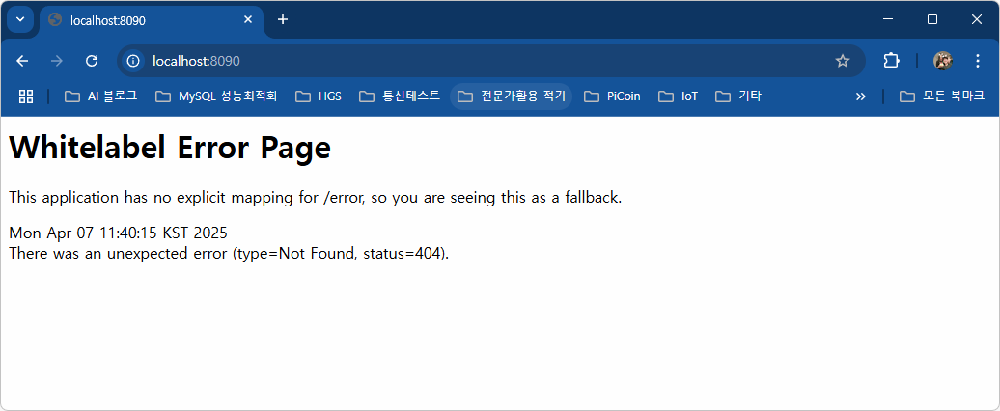

# java-springboot-2025
Java 개발자 과정 SpringBoot 리포지터리

## 1일차(04-01)

### 웹 개요
- 구성 3단계
    - 브라우저(클라이언트/프론트엔드) : 사용자가 **요청**을 하고, 그 결과를 돌려받는 부분
    - 서버(백엔드) : DB에서 사용자 요청 데이터를 가져와 처리하고, 다시 사용자에게 응답하는 부분
    - 데이터베이스 : 가장 중요한 데이터가 저장되어있는 부분
- 웹 개념
    - Request(요청)에 대한 Response(응답)

### Spring Boot 개요
- Java : 컴퓨팅 세상 모든 곳에서 사용될 수 있는 언어가 되고자 개발됨
- Java 웹개발
    1. CGI(Common GateWay Interface) - HTTP 프로토콜에서 정적인 데이터만 전달할 수 있는 웹기술
    2. Servlet - CGI를 개선한 Java 웹기술. 동적웹을 개발할 수 있음
        - HTML 코드를 전부 다 Java에서 작성해야함
    3. EJB(Enterpriise Jaca Bean) - 서블릿으로 대형 프로젝트를 개발할 수 있는 Java 웹기술
        - 많이 복잡함
    4. JSP(Java Server Page) - 자바코드와 웹페이지코드를 분리하여 개발할 수 있는 Java 웹기술
        - 확장자가 JSP / 스파게티 코드
    5. Spring - Java 웹개발 전성기. 웹페이지와 자바영역 분리
        - 설정이 복잡
    6. Spring Boot - Spring의 단점을 최소화. 설정을 간결화

- Spring Boot
    - https://spring.io/projects/spring-boot
    - Spring 기술을 그대로 사용(마이그레이션이 간단)
    - JPA 기술을 사용하면 ERD나 DB설계를 하지않고도 손쉽게 DB를 생성할 수 있음
    - Tomcat Webserver가 내장(설치 필요없음)
    - 서포트하는 기능 다수 존재(개발을 쉽게 도와줌)
    - 테스트용 JUnit, 로그용 log4J2 모두 포함(설치 필요없음)
    - 프론트엔드를 다양하게 지원. JSP, **Thymeleaf**, Mustache 등
    - React, View.js 등의 자바스크립트 프론트엔드와 연계해서 풀스택 개발가능
    - MVC(Model View Controller)로 영역을 분리, 각 부분별로 따로 개발

- MVC
    - View는 JSP포함, Thymeleef, Mustach, HTML 등등

    

### Spring Boot 개발환경 설정
- 필수요소
    - Java, 개발툴, 데이터베이스
- Java
    > 설치 이전에 윈도우 + R > sysdm.cpl > 고급 > 환경변수에 자바 관련 다 지워주기 (충돌방지)
    >
    - Java Runtime과 JDK(Java Developer Kit) 존재
        - Oracle 외에도 OpenJDK가 산재
        - https://www.azul.com/downloads/?package=jdk#zulu
        - https://adoptium.net/
        - https://jdk.java.net/
    - Java 17버전 이상 설치
    - https://www.oracle.com/kr/java/technologies/downloads/archive/
        - Java archive > Java SE > Java SE 17(17.0.13) > Window x64 MSI Installer 설치
        - 경로 : C:\Dev\Lang\Java\jdk-17\
    - 시스템 정보(sysdm.cpl)에서 PATH 설정 (환경변수 설정창)
        - 시스템변수 > 새로만들기
            - JAVA_HOME
        - 시스템변수 > path > 새로만들기
            - %JAVA_HOME%\bin 생성 후 제일 위로 올려주기
    - powershell
        - java --version

- Visual Studio Code 확장 설치
    - Java 검색
        - Extension Pack for Java 설치. Debugger for Java등 총 7가지 확장 설치

### Java 기본 실행
- VS Code에서 명령팔레트 실행(Ctrl + Shift + p)
    - Java create > Maven > Arch..어쩌고 > com.이니셜 후 엔터 > demo는 hello로 수정하고 엔터
        1. build tool > Maven
        2. No ArchType 선택
        3. Group ID 입력 (com.example)
        4. Artifact ID 입력 (demo)
        5. 저장위치 결정

### Spring Boot 설정
- Visual Studio Code 확장 설치
    - Spring 검색
        - Spring Boot Extension Pack 설치(추가 3개 확장 같이 설치됨)
    - Gradle(빌드툴) 검색
        - Gradle for Java 설치

### Spring Boot 기본 실행(Java 프로젝트)
- JDK 버전과 Spring Boot Initializr에 선택하는 JDK 버전이 일치히야함
    - OS에 JDK 버전이 17버전이면 17 선택

- VS Code에서 명령팔레트 실행
    - Spring Initializr : Create a Maven Project
    - Specify Spring Boot version : 3.3.10 선택
    - Specify project language : Java
    - Input Group ID : 본인 아이디 입력 (jm1109)
    - Input Artifact ID : spring01
    - Specify packaging type : Jar(Java archive, 압축파일)
    - Specify Java version : 17
    - Choose dependencied : Selected 0 dependencies
    - 저장위치 선택 (day01)
    - **새 창 열기** - Spring Boot 프로젝트가 루트폴더가 된 개발환경

- 실행방법
    - 코드 작성
    - Spring Boot Dashboard > Apps > 앱 실행

- 기초문법
    - [Java 기초문법](./JAVA_BASIC.md)
    - 기본, 변수, 자료형, 연산자, 흐름제어

## 2일차
- 기초문법 계속
    - [Java 기초문법](./JAVA_BASIC.md)
    - 흐름제어(반복문), 배열, 메서드, 객체/클래스, 상속

## 3일차
- 기초문법 계속
    - [Java 기초문법](./JAVA_BASIC.md)
    - 상속, 인터페이스, 예외처리, 제네릭, 컬렉션 프레임워크, 입출력

### Spring Boot Build Tool
- 개요
    - 프로젝트 빌드 과정을 자동화시켜주는 도구
    - 컴파일, 테스트, 패키징, 의존성 관리, 배포 등등 포함

- Maven
    1. Java 프로젝트 기본 빌드도구
    2. Maven Repository [여기서](https://mvnrepository.com/) 검색가능 > ojdbc11도 검색 후 버전에 맞게 설치
    3. 빌드, 패키징(jar/war 파일 생성), 테스트 등을 한번의 명령으로 간편하게 처리
    4. 가장 큰 특징이 외부 라이브러리 자동으로 다운로드, 관리
    5. pom.xml(Project Object Model) 파일로 빌드 설정을 관리
        - 초기설정시 빠졌거나, 추가되어야 하면 xml 코딩으로 추가
    6. VS Code 확장 중 Maven Dependency Exploere 등으로 확인

- Gradle
    1. 안드로이드용 오픈소스 빌드도구
    2. Maven Repository를 같이 사용
    3. Maven의 3, 4번 특징을 그대로 가지고 있음
    4. build.gradle 파일 사용. Groovy 스크립트 지원
    5. 빌드과정을 병렬처리, 캐싱사용으로 Maven보다 10 ~ 100배 향상된 성능 구현

### Gradle 설정
- Gradle로 프로젝트가 제대로 동작하지 않으면
    - [여기](https://gradle.org/) 에서 Gradle 다운로드
    - 설치 경로 확인, 설치
    - 시스템 등록정보 PATH 지정. GRADEL_HOME 사용

### Spring Boot 로그 설정
- Spring Boot를 colorizing 해주는 기능
- 경로 : src/resources/application.properties

    ```shell
    spring.output.ansi.enabled=always   // 터미널에 색깔
    ```

## 4일차
- 기초문법 마무리
    - [JAVA기초문법](./JAVA_BASIC.md)
    - 제네릭, 컬렉션 프레임워크, 입출력, 람다식, 스트림API

- Gradle 오류 해결방법
    - [Gradle](https://gradle.org/install/)
    - C:\Gradle 위치에 압축해제
    - sysdm.cpl 환경변수 GRADLE_HOME 경로 입력, 확인(JAVA_HOME과 동일)

    

    - VS Code 설정
    
    

    - Gradle Build Server : Enabled 기본 on -> off

    

    - Gradle Home -> 환경변수 입력한 GRADLE_HOME의 경로 입력
    - Gradle Java Home -> 환경변수 JAVA_HOME의 경로 입력

    - VS Code 재시작

## 5일차
- Spring Boot 웹실행
    - Spring Initializr : Create a Gradle Project
    - Specify Spring Boot version : 3.4.4 선택
    - Specify project language : Java
    - Input Group ID : 본인 아이디 입력 (jm1109)
    - Input Artifact ID : spring03
    - Specify packaging type : Jar(Java archive, 압축파일)
    - Specify Java version : 17
    - Choose dependencied : Selected 1 dependencies
        - Spring Web
    - 저장위치 선택
    - **새 창 열기** - Spring Boot 프로젝트가 루트폴더가 된 개발환경

- 기본설정
    - application.properties에 `spring.output.ansi.enabled=always` 추가

- 포트번호
    |프로토콜|포트번호|비고
    |:---|---:|:---|
    |HTTP|80|웹 서버, 서비스포트(보안취약)|
    |HTTPS|443|SSL를 적용한 웹 서비스(보안강화)|
    |FTP|21|웹을 통한 파일전송|
    |SSH|22|보안강화된 텔넷|
    |TELNET|23|원격서버접속 서비스|
    |SMTP|25|메일 전송서비스|

- 개발용 포트
    - 포트는 중복안됨
    - 8080포트를 사용하고 있으면 다른 포트로 변경해야 함
    - 포트 변경시 application.properties에 `server.port=8090` 추가

- 웹브라우저 열기
    - http://localhost:8090/ 오픈

    

- 접속위치 요청 처리
    - 컨트롤러 생성
        - HelloController 클래스 생성 (spring03 우클릭 > New Java File > Class)
        - http://localhost:8090/hello

    - 각 기능별로 패키지를 구분
        - Controller, Model, 등...

- log-back
    - 스프링부트에 내장된 로그 모듈

    - application.properties 내 로그성정

    ```groovy
    logging.level.root = info
    logginf.file.name = /logtest.log
    ```

    - 사용시

    ```java
    // 클래스 내에 작성
    private final Logger logger = LoggerFactory.getLogger(this.getClass());

    // 메서드 내에 작성
    logger.info("hello URL 오픈");
    // 문제 발생시 로그를 남길떄
    logger.debug("디버그시 필요한 로그입니다");
    logger.trace("디버그시 필요한 로그예요");

    logger.warn("경고표시를 나타내는 로그입니다");
    logger.error("에러표시를 나타내는 로그입니다");
    ```

## 6일차(06-26)